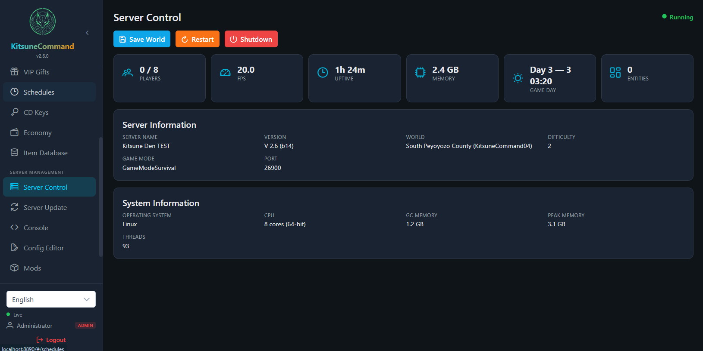
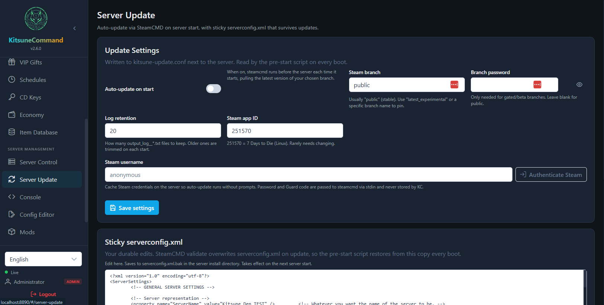
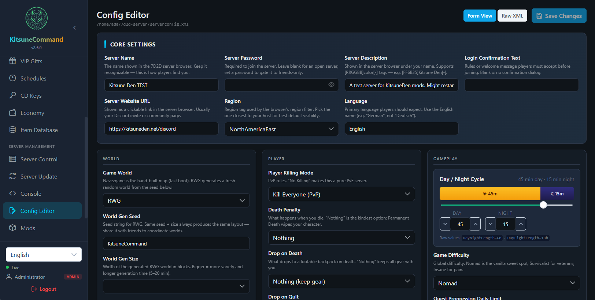
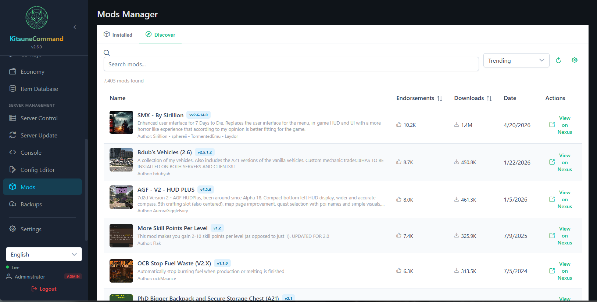
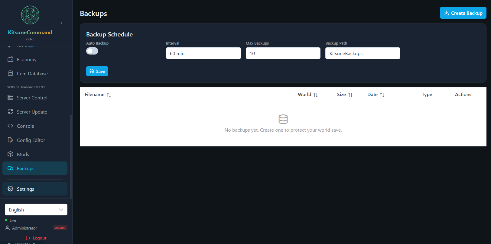
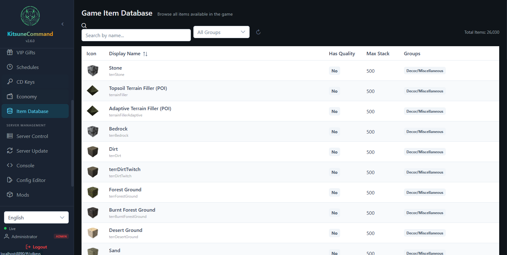
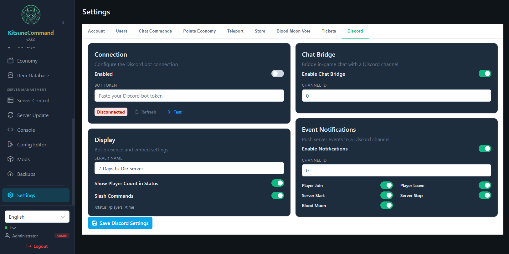
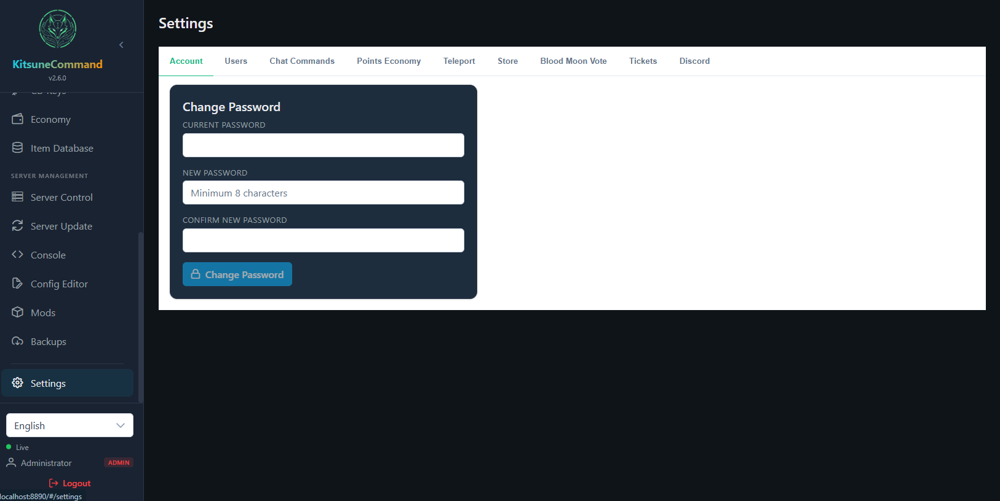

# KitsuneCommand

<p align="center">
  
</p>

<p align="center">
  <strong>Web-based server management for 7 Days to Die</strong><br>
  Monitoring | Management | Map
</p>

<p align="center">
  <a href="https://github.com/AdaInTheLab/KitsuneCommand/actions/workflows/tests.yml"></a>
  <a href="https://github.com/AdaInTheLab/KitsuneCommand/releases/latest"></a>
  <a href="https://github.com/AdaInTheLab/KitsuneCommand/blob/main/LICENSE"></a>
  <a href="https://github.com/AdaInTheLab/KitsuneCommand/pulls"></a>
  
  
  
</p>

---

KitsuneCommand is an open-source mod for 7 Days to Die dedicated servers that provides a RESTful API and a modern web management panel. Runs on both **Windows** and **Linux** servers. Built as a clean-room V2 rewrite of [ServerKit](https://github.com/IceCoffee1024/7DaysToDie-ServerKit) with a modern Vue 3 frontend and improved security.

> **Stuck on something?** See [`docs/troubleshooting.md`](docs/troubleshooting.md) — a growing index of prod-only failures we've actually hit, in symptom → cause → fix shape.

## Features

### Dashboard & Monitoring
- **Web Dashboard** — Real-time server stats, player count, FPS, memory, game day/time
- **GPS Map** — Live Leaflet map with player markers, region tracking, and tile rendering via SkiaSharp
- **Web Console** — Execute server commands from your browser with real-time log streaming and command history

### Player & Chat
- **Player Management** — View online/offline players, inventories, skills, kick/ban
- **Chat System** — View and search chat history, send messages
- **Colored Chat** — Custom name colors and chat formatting per player

### Economy & Rewards
- **Points & Store** — In-game economy with sign-in rewards and a configurable shop
- **CD Keys** — Promo code system with items, commands, expiry, and redemption limits
- **VIP Gifts** — One-time or repeating (daily/weekly/monthly) reward packages per player
- **Purchase History** — Full audit trail of store transactions

### Game Systems
- **Teleportation** — Home, city, and friend teleport systems with point costs
- **Blood Moon Vote** — Players vote on blood moon difficulty before horde night
- **Task Scheduler** — Interval-based automated command execution
- **Game Item Database** — Browse all game items with localized names and icons

### Server Management (Self-Hoster Tools)
- **Server Control** — Save world, shutdown server, live resource monitoring
- **Config Editor** — Edit `serverconfig.xml` with a rich form UI (10 grouped categories) or raw XML
- **Mods Manager** — Browse, upload (ZIP), delete, and enable/disable server mods
- **Auto Backup** — Create, restore, delete, and schedule world save backups
- **Plugin System** — Extend functionality with custom plugin DLLs

### Localization
- **5 Languages** — English, Japanese, Korean, Chinese Simplified, Chinese Traditional

## Screenshots

A tour of the panels you'll spend the most time in.

### Server Control

The first thing you open. Live server stats (FPS, memory, uptime, game day, entity count, online players), one-click Save World / Restart / Shutdown, and a Server Information block with version, world, port, difficulty, and host system info.



### Server Update

Auto-update via SteamCMD on every server start, with a "sticky" `serverconfig.xml` that survives the validate step (Steam normally clobbers your edits — KC restores them from a `.bak` on every boot). Pin to a specific Steam branch, cache Steam credentials so updates don't prompt, and tune log retention.



### Config Editor

`serverconfig.xml` as a real form instead of a wall of XML. Settings are grouped (Core, World, Player, Gameplay, Block Damage), every field has plain-English help text with vanilla-reference numbers ("100% is vanilla, 125% is a gentle boost"), and there's a visual day/night cycle widget with a warm/cool split bar.



### Mods Manager

Browse and install mods directly from a Nexus-backed catalog (sorted by trending, downloads, endorsements, or date), or upload your own ZIP. Handles the messy real-world cases — nested folder structures, Windows backslash paths, mod packs with multiple `ModInfo.xml`, and zips that ship without one — instead of giving up.



### Backups

Schedule world saves on an interval (every N minutes), keep the last K, store them anywhere on disk you want. One-click `Create Backup` for ad-hoc snapshots before risky changes; restore in a click.



### Item Database

Search across every item the game knows about (26,000+ entries on a typical install), with icons, internal names, max stack, quality flag, and group tags. Useful for `give` commands, store inventory, and CD-key reward design.



### Settings → Discord

Discord bot integration in one tab: paste token, toggle bidirectional chat bridge, push event notifications (player join/leave, server start/stop, blood moon) to a channel of your choice, and register `/status`, `/players`, `/time` slash commands.



### Settings → Account

Self-service password change for the logged-in user. If you ever lock yourself out entirely, the [`kcresetpw`](docs/troubleshooting.md) console command is your escape hatch.



## Tech Stack

| Layer | Technology |
|-------|-----------|
| Backend | C# 11 / .NET Framework 4.8 / OWIN / ASP.NET Web API 2 |
| Frontend | Vue 3 / TypeScript 5 / Vite 6 / PrimeVue 4 |
| Database | SQLite / Dapper |
| Real-time | WebSocketSharp |
| Auth | OAuth2 with BCrypt password hashing |
| Map | SkiaSharp tile rendering + Leaflet |
| Game Integration | Harmony runtime patching |
| DI | Autofac |
| Testing | NUnit 4 + Moq (backend) / Vitest (frontend) |

## Requirements

- 7 Days to Die Dedicated Server (V2.5+)
- **Windows**: .NET Framework 4.8 runtime (included with Windows)
- **Linux**: Mono runtime (included with 7D2D server), `libsqlite3-0` (usually pre-installed)
- For building from source: .NET SDK 8.0+ and Node.js 18+

## Installation

1. Download the latest release from [Releases](https://github.com/AdaInTheLab/KitsuneCommand/releases)
2. Extract the `KitsuneCommand` folder into your server's `Mods/` directory:
   ```
   7DaysToDieServer/
     Mods/
       KitsuneCommand/
         ModInfo.xml
         KitsuneCommand.dll
         KitsuneCommand.dll.config
         Config/
           Migrations/
           appsettings.json
         wwwroot/
         Plugins/
         x64/                       # Windows native libraries
           sqlite3.dll
           libSkiaSharp.dll
         linux-x64/                 # Linux native libraries
           libSkiaSharp.so
   ```
3. Start your dedicated server
4. Open `http://your-server-ip:8890` in a browser
5. On first run, check the server console for your auto-generated admin credentials

> **Port note:** The web panel runs on port **8890**, not port 8888. Port 8888 is used internally for the API backend, but a lightweight frontend server on port 8890 handles login and proxies API calls to 8888 automatically. This split is needed due to a compatibility issue between 7D2D's Unity/Mono runtime and the OWIN OAuth middleware.

> **Linux note:** The same release ZIP works on both Windows and Linux. The mod auto-detects the platform and loads the correct native libraries. On Linux, SQLite uses the system's `libsqlite3` via Mono DLL mapping.

## Project Structure

```
KitsuneCommand/
├── src/
│   ├── KitsuneCommand/               # Main mod (C# DLL)
│   │   ├── Core/                     # Lifecycle, DI, event bus
│   │   ├── Data/                     # SQLite repos, entities, migrations
│   │   ├── Features/                 # Game features (points, teleport, etc.)
│   │   ├── Services/                 # Backup, config, map, mods, items
│   │   ├── Web/                      # Controllers, auth, models
│   │   ├── WebSocket/                # Real-time event broadcasting
│   │   ├── Config/Migrations/        # SQL migration files (001-006)
│   │   └── 7dtd-binaries/            # Game DLLs (gitignored, see below)
│   ├── KitsuneCommand.Abstractions/  # Plugin API interfaces
│   ├── KitsuneCommand.Tests/         # NUnit test project
│   └── RuntimeInfoShim/              # .NET compatibility shim
├── frontend/                         # Vue 3 web panel
│   ├── src/
│   │   ├── api/                      # Axios API clients
│   │   ├── components/               # Shared Vue components
│   │   ├── composables/              # WebSocket, permissions
│   │   ├── i18n/locales/             # en, ja, ko, zh-CN, zh-TW
│   │   ├── stores/                   # Pinia state management
│   │   ├── views/                    # Page components
│   │   └── __tests__/                # Vitest test files
│   └── vitest.config.ts
├── build-sqlite/                      # System.Data.SQLite source (SQLITE_STANDARD)
├── tools/
│   ├── build.ps1                     # Full build + package script (Windows/Linux/both)
│   └── build.sh                      # Linux build script
├── KitsuneCommand.sln
└── README.md
```

## Building from Source

### Prerequisites

1. [.NET SDK 8.0+](https://dotnet.microsoft.com/download)
2. [Node.js 18+](https://nodejs.org/)
3. Game binary references — copy these from your 7D2D install's `7DaysToDie_Data/Managed/` folder into `src/KitsuneCommand/7dtd-binaries/`:
   - `Assembly-CSharp.dll`
   - `Assembly-CSharp-firstpass.dll`
   - `LogLibrary.dll`
   - `UnityEngine.dll`
   - `UnityEngine.CoreModule.dll`
   - `0Harmony.dll`

### Frontend

```bash
cd frontend
npm install
npm run dev      # Development server with hot reload (proxies API to :8888)
npm run build    # Production build → src/KitsuneCommand/wwwroot/
```

### Backend

```bash
dotnet build src/KitsuneCommand/KitsuneCommand.csproj -c Release
```

### Full Build + Package

```powershell
.\tools\build.ps1                    # Build for both platforms
.\tools\build.ps1 -Platform windows  # Windows only
.\tools\build.ps1 -Platform linux    # Linux only
# Output: dist/KitsuneCommand/ (ready to copy to Mods/)
```

This builds both frontend and backend, then packages everything into a deployable mod folder with the correct native libraries for each platform.

### Deploy to Server

Copy the `dist/KitsuneCommand/` folder (or individual files) to your server:

```
YourServer/Mods/KitsuneCommand/
```

> **Note:** Backend changes (DLL) require a server restart. Frontend changes (wwwroot/) are served from disk and take effect immediately.

## Testing

### Backend (NUnit)

```bash
cd src/KitsuneCommand.Tests
dotnet test
```

62 tests covering:
- **Repository integration tests** — PointsRepository, UserAccountRepository, SettingsRepository (real SQLite)
- **Service unit tests** — AuthService, ServerConfigService, PasswordHasher (with Moq)
- **Core tests** — ModEventBus pub/sub, thread safety

### Frontend (Vitest)

```bash
cd frontend
npm run test:run    # Single run
npm run test        # Watch mode
```

21 tests covering:
- **Pinia store tests** — Auth (login/logout/localStorage), Economy (points updates)
- **API client tests** — Backups API response unwrapping and error handling

## Configuration

Settings are stored in `<SaveGameDir>/KitsuneCommand/appsettings.json`:

| Setting | Default | Description |
|---------|---------|-------------|
| `WebUrl` | `http://*:8888` | Internal API bind address (do not change; access the panel on port **8890**) |
| `WebPanelPort` | `8890` | Frontend/login port — this is what you open in your browser |
| `WebSocketPort` | `8889` | WebSocket server port |
| `DatabasePath` | `KitsuneCommand.db` | SQLite database location |
| `AccessTokenExpireMinutes` | `1440` | Auth token lifetime (24h) |
| `EnableCors` | `false` | Enable for frontend dev with Vite |

## Troubleshooting

A growing index of prod-only failures, in symptom → cause → fix shape. Lives at [`docs/troubleshooting.md`](docs/troubleshooting.md).

Current entries cover: panel lockout recovery (`kcresetpw`), the Cloudflared + WebSocketSharp host-header gotcha, SkiaSharp Linux native loading, IPv6 vs IPv4 tunnel routing, and frontend deploy hygiene.

If you fix a gnarly prod bug, the last commit of the fix PR should add an entry.

## Console Commands

All commands use the `kc-` prefix:

| Command | Description |
|---------|-------------|
| `kc-gi` | Give items to a player |
| `kc-gm` | Send global message |
| `kc-pm` | Send private message |
| `kc-rs` | Restart server |
| `kcresetpw` | Reset a panel user's password (admin recovery — see [Troubleshooting](docs/troubleshooting.md)) |

## Creating Plugins

Reference `KitsuneCommand.Abstractions.dll` and implement `IPlugin`:

```csharp
using KitsuneCommand.Abstractions;

public class MyPlugin : IPlugin
{
    public string Name => "MyPlugin";
    public string Version => "1.0.0";
    public string Author => "You";

    public void Initialize(PluginContext context)
    {
        context.EventBus.Subscribe<ChatMessageEvent>(msg =>
        {
            // React to chat messages
        });
    }

    public void Shutdown() { }
}
```

Place the compiled DLL in the `Plugins/` directory.

## License

[MIT](LICENSE)

## Credits

- Original concept: [ServerKit](https://github.com/IceCoffee1024/7DaysToDie-ServerKit) by IceCoffee1024
